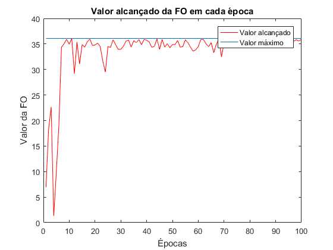
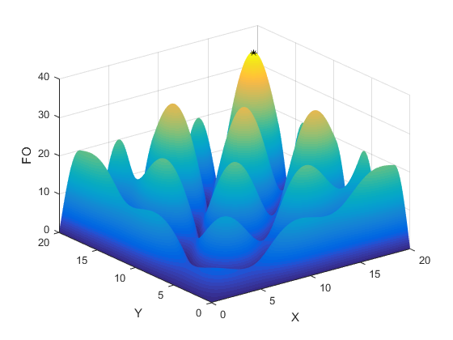

# Algoritmo Genético
> O objetivo é encontrar o máximo da função f(x,y) = |xsen(ypi/4) + ysen(xp/4)| com Algoritmo Genético.

**_Descrição:_**

Cada indivíduo da população é um vetor binário de 20 bits,em que os 10 primeiros
representam x e os restantes representam y. As variáveis x e y pertencem ao intervalo entre 0 e 20.

**_Implementação:_**

Para implementar o GA foram definidos o número de indivíduos e épocas
(estes facilmente modificados). Para exemplificar vamos considerar neste documento
100 épocas e 500 indivíduos.

Inicialmente, na primeira época, a população de indivíduos é gerada
aleatoriamente na forma binária. Estes são convertidos para seu valor decimal e
adequados a formulação do problema. Em todas as épocas, a função de avaliação que
atribui as notas dos indivíduos é o valor da função objetivo (FO) quando estes são
aplicados. De acordo com as notas, os mesmos são alocados em uma roleta para a
escolha. Os indivíduos são selecionados para se tornarem pais, e fazem cruzamento
aos pares, gerando os filhos através do crossover de um ponto. Sendo este ponto de
corte escolhido de forma aleatória. E em seguida, o melhor individuo é escolhido para
cada época.

Na janela de comandos do MATLAB é gerado uma lista com todos os
indivíduos escolhidos para cada época. Além do gráfico que mostra o progresso do
algoritmo em relação à FO em cada época, também é ilustrado o valor
alcançado ao fim do período de 100 épocas.

  

Podemos perceber que o algoritmo converge para a solução que maximiza
a FO, dentro dos limites adotados no problema.

